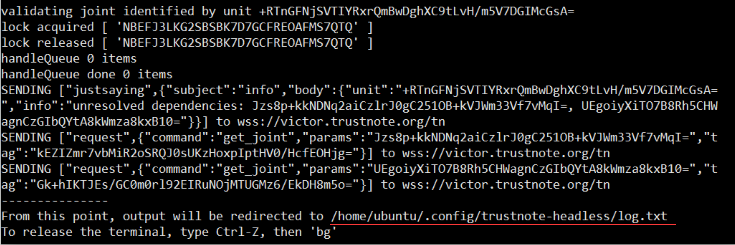
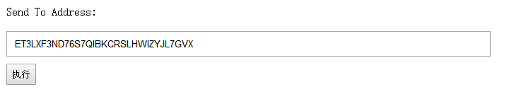

在TrustNote 公链上发行Token
===============================

以下教程在Ubuntu 16.04 上测试通过，根据以下操作指引，开发者可以快速地在TrustNote公链上发行自己的Token。
<!-- //NODE.JS ENV  -->
<!-- // VERSION  -->
## 环境配置
安装 Node.js 8:
```bash
curl -sL https://deb.nodesource.com/setup_8.x | sudo -E bash -
sudo apt-get install -y nodejs
```

查看Node.js 版本号
```bash
node -version
```
如果可以看到版本号，则代表Node.js已经安装成功。


安装 build-essential
```bash
sudo apt-get install -y build-essential
```


## 下载示例代码

从github.com上下载示例代码

```bash
git clone https://github.com/llcds/trustnote-token.git
```
 安装 node依赖包
```bash
cd trustnote-token
npm install
```
这会花费一些时间，需要耐心等待。`npm install` 成功后可以看到命令行如下提示:


由于网络原因，运行`npm install `可能会耗费非常长的时间，有时候甚至会安装失败。用户可以 更改npm源来解决此问题，具体操作参考 https://yq.aliyun.com/articles/5543 。


设置测试网络参数  
```bash
 bash testify.sh
```

### 运行

启动节点，等待数据同步
``` bash
node start.js
```
在启动节点过程中，遇到需要输入参数的地方，全部按回车键


如果可以在日志中看到 `validating joint identified by unit...`字样，说明此时节点已经开始同步数据。如需查看完整日志，可以打开日志文件查看。划红线的路径即是日志文件路径。


在网络良好的情况下，数据同步大概需要10~20分钟的时间。


在TrustNote公链上发行Token，转账都需要花费一定量的TTT，开发者需要到 www.trustnote.org/token.html 上领取测试用的TTT。具体操作如下：

1：打开 www.trustnote.org/token.html 

2：输入钱包地址。（当前节点地址可以在 `address.json`文件中查看）


3：点击 `执行` 领取TTT。


####    发行Token
1. 运行脚本  在命令行输入 `node create_asset.js`
如果发行成功，会在 `asset.json` 看到TokenId，这个TokenId就是刚才发行的Token的标识符。


####    转帐
 1. 设置参数   用文本编辑器打开 `transfer_asset.js`，将 `'DJw4edxgaSbt7VGTsmsadmRdYJ+Vvz1Hrhy+JGrAyiA='`替换成`asset.json`中的TokenId。
 2. 在命令行输入 `node transfer_asset.js` 

####    查询余额
1. 设置参数   用文本编辑器打开 `balance.js`，将 `'DJw4edxgaSbt7VGTsmsadmRdYJ+Vvz1Hrhy+JGrAyiA='`替换成`asset.json`中的TokenId。
2. 运行脚本  在命令行输入 `node balance.js`


**注意：** 
1. 当前运行环境是TrustNote测试网络。
2.  测试网络浏览器地址 https://testexplorer.trustnote.org