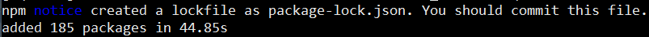
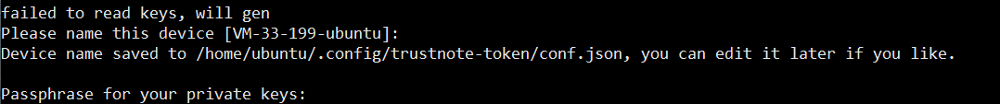

如何在TrustNote 公链上发行你自己的Token
===============================

Note: 以下教程在Ubuntu 16.04 上测试通过，根据以下操作指引，开发者可以快速地在TrustNote公链上发行自己的Token。
<!-- //NODE.JS ENV  -->
<!-- // VERSION  -->
### 环境配置
安装 Node.js 8:
```bash
curl -sL https://deb.nodesource.com/setup_8.x | sudo -E bash -
sudo apt-get install -y nodejs
```

查看Node.js 版本号
```bash
node -version
```
如果可以看到版本号，则代表Node.js已经安装成功。


安装 build-essential
```bash
sudo apt-get install -y build-essential
```


### 下载示例代码

从github.com上下载示例代码

```bash
git clone https://github.com/trustnote/asset-manger.git
```
 安装 node依赖包
```bash
cd asset-manger-demo
npm install
```
这会花费一些时间，需要耐心等待。`npm install` 成功后可以看到命令行如下提示:



由于网络原因，运行`npm install `可能会耗费非常长的时间，有时候甚至会安装失败。用户可以 更改npm源来解决此问题，具体操作参考 https://yq.aliyun.com/articles/5543 。


设置测试网络参数 
```bash
 bash testify.sh
```

### 运行
在TrustNote公链上发行Token大概需要花费0.001MN TTT，开发者在创建好地址后，需要到网站上领取1MN的Token。

创建钱包地址
```
npm run create
```
如果address.json 中能看到{address:''}，代表钱包地址已经创建。

获取测试网络TTT token


启动节点，等待数据同步
```
node run startup
```
在启动节点过程中，遇到需要输入参数的地方，全部按回车键。




如果可以在日志中看到 `validating joint identified by unit...`字样，说明此时节点已经开始同步数据。


此时开始同步数据，等待数据同步大概需要十分钟的时间。

如果看到


发行资产
 1. 设置参数   用文本编辑器打开 `create_asset.js` 
 2. 运行脚本

如果转账成功，会在 `asset.json` 看到TokenId，这个TokenId就是刚才发行的Token的标识符。


转移资产

 1. 设置参数   用文本编辑器打开 `transfer_asset.js` 修改参数
 2. 运行脚本


查询余额
1. 设置参数   用文本编辑器打开 `balance.js` 修改参数
2. 运行脚本


startup a TrustNote client && Sync data
-------------------
`node start.js`

// success ,error ,


pay some notes to current address
-------------------
issue asset will cost some notes. the address can be found in `address.json` file after runing `node start.js`


Running
-------------------
1. create asset

    `node create_asset.js`
    
    this script will create a new asset,and you can find assetId in `asset.json` file

2. transfer asset 

    `node transfer_asset.js`

     replace `'keGceo71bpB47byxp632jnxA86QuJ7rlePRb7+sPrUg='` with your own assetId before runing this script.


3. get balance

    `node balalce.js`

    replace `'keGceo71bpB47byxp632jnxA86QuJ7rlePRb7+sPrUg='` with your own assetId before runing this script.

